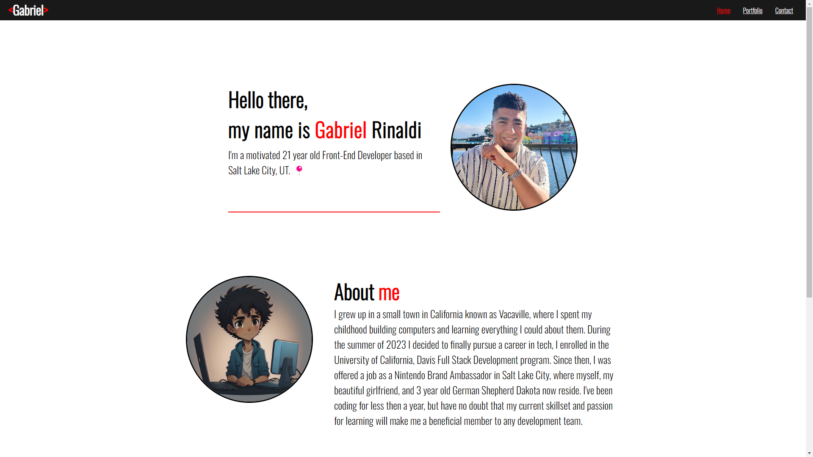

# Portfolio

## Description

This project means a lot to me. I'm nearing the end of my University of California, Davis Development Bootcamp and this is my first big project on my own. This project is just a small fraction of everything I was able to learn and accomplish in a short duration of time. I have no doubt my skillset will continue to grow exponentially over the upcoming months. I made this portfolio to show my current skillset and also to present upcoming projects I will be working on upon completion. This project will allow future employers and clients to learn more about me, my style, and my work.

This application was built using:

- HTML
- CSS
- JavaScript
- Node
- React

## Installation

N/A

## Usage

Home:

- Short autobiography
- List of my most utilized skills

Portfolio:

- List of some of my recent projects
- Link to each deployed project
- Link to each of the GitHub repositories

Contact:

- Contact form to reach me
- Name input
- Email input
- Message input

Footer:

- Icons to redirect users to my personal pages.

## Credits

N/A

## License

Please refer to the LICENSE in the repo.

## Screenshots

